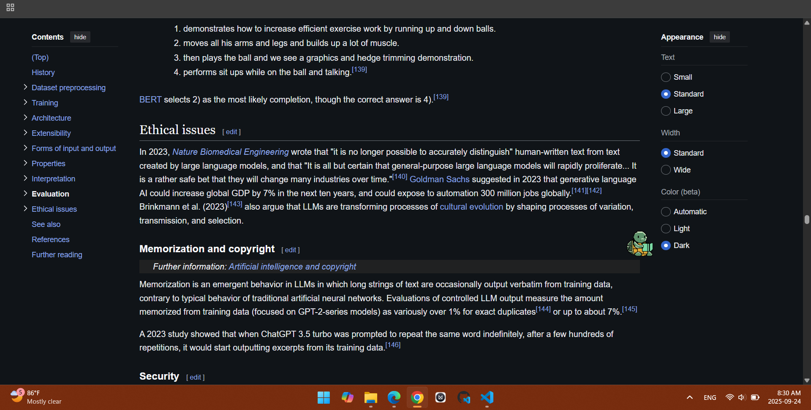

Turtly Extension:
    Discription:
        A Simple Turtle Companion to accompany you while studying. It pops in and studies with you as
         you study articles and it can give you it's thoughts on the important information through
         highlights that if you like can persist across sessions.
        Aimed to be a friend that is by your side struggling with you and it will take the burden of
        highlighting whatever you're reading so you can focus on studing.
        The project started as a Hackathon project, then my ADHD kicked in and now i'm working on a
         companion that could acompany me on my late night studing sessions.

         

    Scope:
        A turtle companion that pops out dynamically while you are reading and studies alongside you, it
        can highlight what it sees as important as it is reading it and you can click it to finalize or remove the highlight.
        It will also have features like being able to summarize the paragraph it
        read and basically give you quick notes - it is designed to learn by your side not to be a
        cheatcode it's just a simple companion that handles the tedious or low effort stuff.

    DONE:
        (v0.0.1)
        - Basic Extension
        - Loads and keeps track of the number of paragraphs in a website
        - Keeps track of the current focused paragraph
        - Early Debugging and setting up the environment for the
          upcoming features
        - Early repository setup

        (v0.0.2)
        - Cleaner Project structure
        - Added the Idle Spirte for the turtle (Animations are still WIP)
        - turtle sprite now appear at the end of the paragraph (WIP)

    TODO:
        (v0.0.2)
        - Implement the sprites for the turtle (idle (Main layer done), dig down (WIP) and dig up (WIP))
        - Add the icons for the extension
        - Implement the popup, idle and dig down animations
        - Early setup of the highlight system

        (v0.0.3)
        - The turtle highlight passages as it's reading (Highlights are faint)
        - Implement the highlight locking after the user clicks the turtle (Highlights become more
        apparent)
        - Make the highlights persistant through reloads
        - Clean up and Polishing
